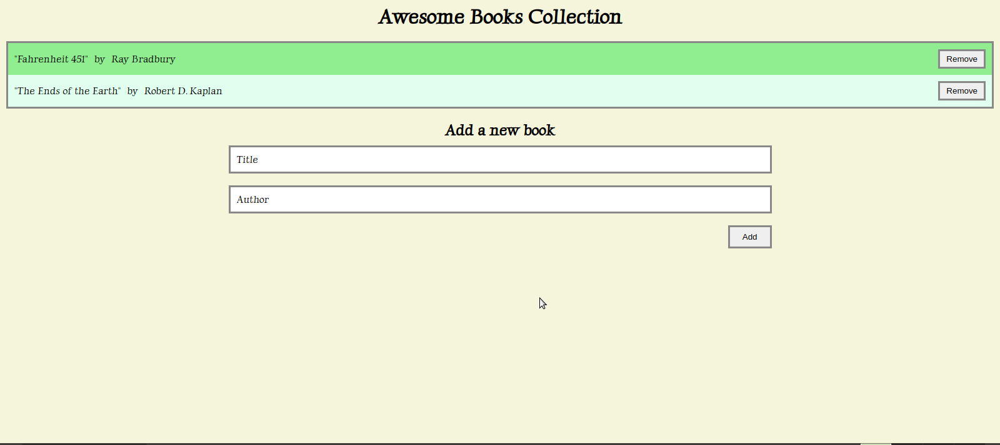

# Title

Awesome Books

> This project presents a basic website that allows users to add/remove books from a list.

## Built With

- HTML
- CSS
- JavaScript

## Live Demo

[Live Demo Link](https://gegardus.github.io/Awesome-Books/)

## Getting Started

To get a local copy, clone from the link below.

https://github.com/Gegardus/Conference-Page

## Author

👤 **Vahan Khachvankian**

- GitHub: https://github.com/Gegardus

## Contributor

👤 **Adebisi Ayodele Samuel**

- GitHub: [@githubhandle](https://github.com/aeon9300)
- Twitter: [@twitterhandle](https://twitter.com/aeon9300)
- LinkedIn: [LinkedIn](https://www.linkedin.com/in/samuel-adebisi-4a589362/)

## 📝 License

This project is [MIT](./MIT.md) licensed.
